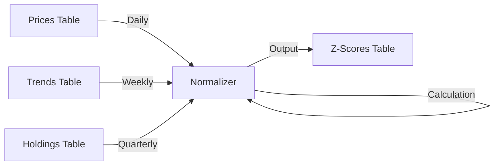

# Normalization Technical Specification

## Architecture

The `ZScoreNormalizer` implements a **Frequency-Specific Normalization** strategy to handle disparate time scales:

1.  **Extract**: `_load_data()` queries `prices` (Daily), `google_trends` (Weekly), and `institutional_holdings` (Quarterly).
2.  **Calculate (Pre-Merge)**: Z-scores are calculated **separately** for each data source using its native frequency.
    *   Prices: 30-day rolling window.
    *   Trends: 4-week rolling window.
    *   Holdings: 4-quarter rolling window.
3.  **Merge & Fill**: The Z-score series are merged onto the Daily timeline. Weekly and Quarterly Z-scores are forward-filled to provide continuous coverage.
4.  **Load**: `_save_scores()` inserts results into the `z_scores` table.

## Statistical Methodology

### Formula
We use the standard Z-Score formula:
$$ Z = \frac{x - \mu}{\sigma} $$

### Rolling Windows
> [!IMPORTANT]
> **Design Decision: Frequency-Specific Windows**
> We deliberately deviated from the generic 30/90-day window spec. Instead, we match the window to the *data frequency* (e.g., 4-quarter window for Quarterly data). This prevents statistical artifacts (NaNs) caused by calculating variance on flat, upsampled lines.

Instead of a one-size-fits-all window, we align the window to the data's update frequency:

| Data Type | Frequency | Window Size | Min Periods | Rationale |
| :--- | :--- | :--- | :--- | :--- |
| **Price** | Daily | 30 Days | 14 | Catch short-term divergence against monthly volatility. |
| **Search** | Weekly | 4 Weeks | 4 | Compare this week against the last month of activity. |
| **Holdings** | Quarterly | 4 Quarters | 2 | Compare this quarter against the last year of ownership trends. |

### Outlier & Edge Case Handling
- **Zero Variance**: If standard deviation is 0 (flat line), Z-score is `NaN` (undefined).
- **Forward Filling**: Z-scores are forward-filled (limit 7 days for Trends, 95 days for Holdings) to ensure the daily dashboard has valid data points for all metrics.
- **Data Types**: All `DECIMAL` inputs from the database are explicitly cast to `float` to ensure NumPy compatibility.

## Data Flow Diagram

